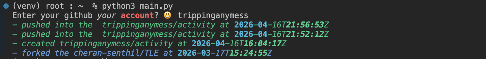

## This is a basic github activity monitor CLI application.

## Features:
- tracks all the latest github activity and gives a short one line activity description for each including the time
    when the activity was done.
- color grading for checking on different types of activities.

## How to use: 
- clone the repository : 
    `git clone "https://github.com/trippinganymess/activity"`
    `cd activity`
- create a virtual environment
    use: `python -m venv venv`
    and then activate using
        for bash (mac) : `source venv\bin\activate`
        for bash (windows) : `source venv/Scripts/activate`
        for cmd :  `.\venv\Scripts\activate.bat`
        for PowerShell : `.\venv\Scripts\Activate.ps1`

- Install the requirements mention in the requirements.txt, 
    use : `pip install -r requirements.txt`
- Then simply run main.py
    use : `python main.py`
### sample run :

`The github api only allows 60 requests per hour, so if that limit is crossed the application will timeout.`

